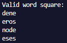
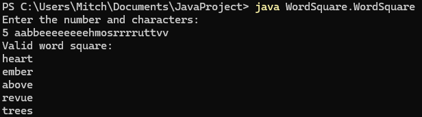
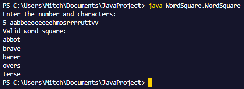
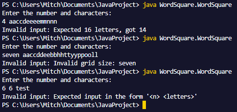

# Word Square Generator

A Java program that uses a naive backtracking algorithm to generate a valid word square from a set dictionary of words. 

## Project Overview

This program takes a grid size and a set list of characters as an input, then uses enable1.txt to find words that fit those parameters. It constructs a word square using a backtracking algorithm where:
- Each row is a valid word form the dictionary
- Each column is a valid word from the dictionary 
- The same intput characters are used to form all the words

## Project Structure

- **WordSquare.java** - Main entry point, handles user inpout and validation
- **WordGeneration.java** - Takes a dictionary file and generates feasible candidates given the letter group and grid size
- **SquareBacktracker.java** - Recursively searches the candidate list using a backtracking algorithm to create a valid word square
- **LetterGroup.java** - Manages the letter count and grouping
- **enable1.txt** - Dictionary file containing the valid words


## Prerequisites

- Java Development Kit (JDK) 11 or higher
- The `enable1.txt` dictionary file must be present in the `WordSquare/` directory (or any other dictionary file, must be updates in WordGeneration.txt)

## How to Compile

Navigate to the project root directory (JavaProject) and compile all Java files:

```bash
javac WordSquare/*.java
```

## How to Run

Execute the program from the project root directory:

```bash
java WordSquare.WordSquare
```

## Usage

The program prompts you to enter:
1. **Grid size (n)**: An integer representing the size of the word square (e.g., 4 for a 4×4 square)
2. **Characters**: Exactly n² characters to form the word square (e.g., 16 for a 4x4 square)

### Input Format

```
<n> <characters>
```

**Example for a 4×4 word square:**
```
4 eeeeddoonnnsssrv
```

This creates a 4×4 grid using the characters: e,e,e,e,d,d,o,o,n,n,n,s,s,s,r,v

### Output

If a valid word square is found, the program displays all n words that form the square:



If no valid word square can be created with the given characters, the program outputs:




## Example Usage



## Error Handling

The program validates input and displays error messages for:
- Invalid grid size (non-integer values)
- Incorrect number of characters (must equal n²)
- Improperly formatted input



## Algorithm Details

The program uses a backtracking algorithm to search for valid word squares:

1. Loads all valid dictionary words from enable1.txt
2. Filters words that match the required length and available characters
3. For each row, finds candidate words that match the column constraints
4. Recursively attempts to place words while adhering to character availability
5. Backtracks when no valid word can be found and tries an alternative path
6. Returns the first valid solution found, or that no solution exists

## Performance Notes

- The program may take some time to run for larger grid sizes
- Character availability is strictly enforced; each input character can only be used once